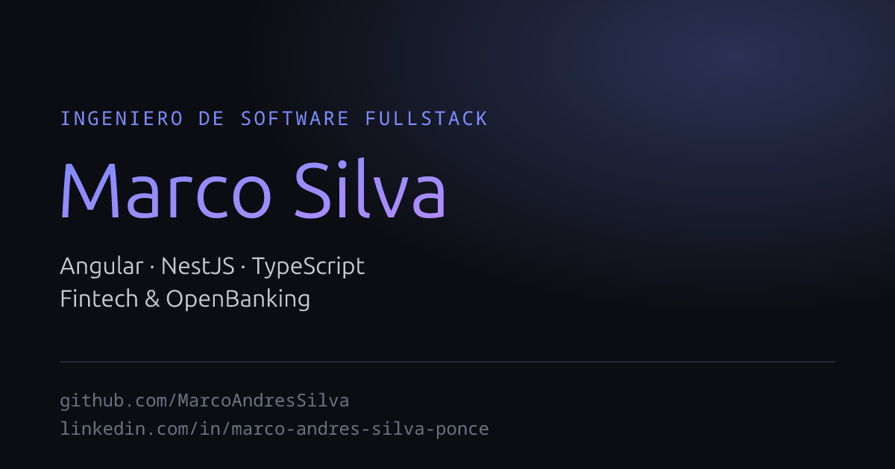
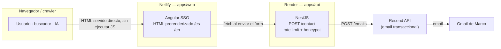

<p align="center">
  
</p>

<h1 align="center">Portfolio-Developer</h1>

<p align="center">
  Portafolio de <strong>Marco Andrés Silva</strong> — Fullstack Developer (Angular · NestJS · TypeScript)
</p>

<p align="center">
  <a href="https://gentle-ganache-580791.netlify.app"><strong>🌐 Sitio en vivo</strong></a>
  &nbsp;·&nbsp;
  <a href="https://portfoliodev-api.onrender.com"><strong>⚙️ API</strong></a>
  &nbsp;·&nbsp;
  <a href="./ARCHITECTURE.md"><strong>📄 Arquitectura del proyecto</strong></a>
</p>

<p align="center">
  <a href="https://github.com/MarcoAndresSilva/Portfolio-Developer/actions/workflows/ci.yml">
    
  </a>
  =22.22.3" />
  
  
  
  <a href="./LICENSE"></a>
</p>

---

## Por qué existe este proyecto

La mayoría de los portafolios de desarrolladores son SPAs 100% client-side: si un crawler (un
buscador, o una IA) intenta leer el sitio sin ejecutar JavaScript, no encuentra nada — solo
"necesitas JavaScript para ver esto". Para una carta de presentación, eso es un defecto grave.

Este proyecto lo resuelve de raíz con **Angular SSG (prerender)**: el contenido real —texto,
proyectos, experiencia— viaja dentro del HTML que se sirve, sin depender de que nada se ejecute
del lado del cliente. Es, a la vez, el portafolio y la prueba de que sabe resolver ese problema.

## Features

- 🏗️ **SSG real, no SPA** — todas las rutas se prerenderean a HTML estático; el contenido es
  legible por cualquier crawler sin ejecutar JS.
- 🌍 **i18n ES/EN** con `@angular/localize` — builds localizados (`/es`, `/en`), cada uno un sitio
  estático completo e indexable.
- 🔍 **SEO/GEO completo** — meta tags, Open Graph, Twitter Card, `canonical` + `hreflang`,
  JSON-LD (`Person`/`WebSite`/`ProfilePage`), `sitemap.xml` / `robots.txt` / `llms.txt` generados
  en el build.
- ♿ **Accesibilidad AA** — skip-link, `focus-visible`, roles/labels correctos, contraste
  verificado en ambos temas.
- ✉️ **Backend propio de contacto** — API NestJS con rate limiting, honeypot anti-spam y envío de
  email real (Resend), no un formulario de terceros.
- 🎨 **Animaciones con progressive enhancement** — GSAP + `IntersectionObserver`; sin JS, nada se
  oculta ni se rompe (respeta `prefers-reduced-motion`).
- ✅ **CI + Lighthouse CI** — typecheck / lint / test / build en cada push, con auditoría de
  performance/accesibilidad/SEO automática y bloqueante.

## Stack

| | |
|---|---|
| **Monorepo** | npm workspaces (`apps/*`, `libs/*`) |
| **`apps/web`** | Angular 22 (standalone + signals), SSG/prerender, SCSS + design tokens, GSAP, i18n ES/EN |
| **`apps/api`** | NestJS 12 — formulario de contacto, rate limiting, honeypot, email vía Resend |
| **`libs/shared`** | Interfaces TypeScript compartidas (`Project`, `Experience`, `Skill`, `SocialLink`) |
| **Infraestructura** | Netlify (sitio, deploy automático desde `main`) + Render (API) |
| **Calidad** | GitHub Actions, Lighthouse CI, Vitest |

## Arquitectura



## Requisitos

- Node `>=22.22.3` (ver `.nvmrc` → `22.23.1`; lo exige Angular 22). Con nvm: `nvm use`
- npm `>=10`

## Cómo correrlo

```bash
npm install          # instala todos los workspaces
npm run web           # levanta apps/web en dev  → http://localhost:4200
npm run api           # levanta apps/api en dev   → http://localhost:3100

npm run typecheck     # \
npm run lint          #  } lo que corre la CI en cada push/PR
npm run test          #  }
npm run build         # /
```

## Estructura del repo

```
Portfolio-Developer/
├── apps/
│   ├── web/     # Angular 22 (SSG) — el sitio
│   └── api/     # NestJS 12 — contacto por email + anti-spam
├── libs/
│   └── shared/  # @portfolio/shared — interfaces TS (solo tipos)
├── .github/workflows/ci.yml
├── render.yaml          # Blueprint de Render para apps/api
├── netlify.toml         # Config de Netlify para apps/web
└── lighthouserc.json    # Config de Lighthouse CI
```

## Documentación

- [`ARCHITECTURE.md`](./ARCHITECTURE.md) — estado del proyecto, decisiones de diseño y su porqué,
  roadmap y próximos pasos.

## Autor

**Marco Andrés Silva** — Fullstack Developer (Angular · NestJS · TypeScript)

[GitHub](https://github.com/MarcoAndresSilva) · [LinkedIn](https://www.linkedin.com/in/marco-andres-silva-ponce-b42286b4/) · [marco.silvaponce10@gmail.com](mailto:marco.silvaponce10@gmail.com)

## Licencia

[MIT](./LICENSE)
